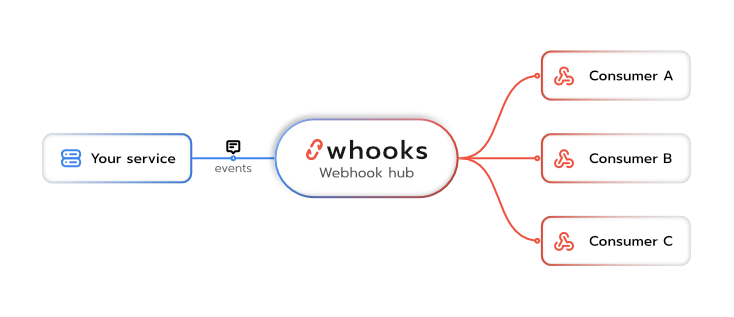

  <picture>
    
  </picture>

  <h1>Open source webhook router and dispatcher</h1>
  
Whooks is a highly scalable and feature-rich webhook management system. Built on the power of Elixir and the Phoenix framework.
Designed for robust performance and fault tolerance, it serves as a central hub for reliably processing and routing real-time events.

  <picture>
    
  </picture>

### Features

- **Automatic Retries**: To ensure event delivery even in the face of temporary network issues or target service downtime, the dispatcher incorporates intelligent, configurable automatic retry mechanisms.
- **Event Filtering**: Users can precisely control which events are sent to which targets through advanced event filtering rules, optimizing bandwidth and ensuring recipients only receive relevant data.
- **Multiple Targets**: The system supports defining multiple distinct targets (endpoints) for the same event source, allowing for flexible event distribution across diverse services and applications.
- **Comprehensive Monitoring UI**: A rich, user-friendly monitoring interface built with Svelte, Inertia.js and Tailwind CSS provides deep visibility into the dispatcher's operations. This includes real-time dashboards to track delivery status, latency, error rates, and the history of all dispatched webhooks, making troubleshooting and performance analysis straightforward.
- **Built on Elixir and Phoenix**: Leveraging the high concurrency and fault-tolerance inherent in the Elixir language and the Phoenix framework.
